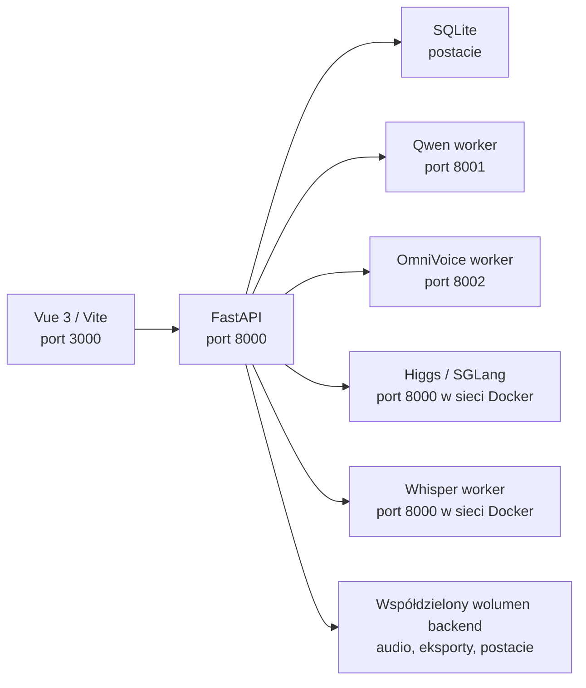

# Dokumentacja techniczna

## Architektura



Frontend komunikuje się z API przez adres `http://127.0.0.1:8000`. API udostępnia katalogi wynikowe jako statyczne zasoby HTTP. Provider TTS jest lekkim adapterem HTTP; właściwy model pozostaje w dedykowanym workerze. Dzięki wspólnemu montowaniu `./backend:/app` workery dostają ścieżki do tych samych plików audio bez przesyłania ich przez HTTP.

## Usługi Docker Compose

| Usługa | Rola | Port hosta |
|---|---|---|
| `frontend` | aplikacja Vue w trybie deweloperskim | 3000 |
| `api` | FastAPI, SQLite, łączenie audio, OCR, eksport | 8000 |
| `worker-qwen` | Qwen3 TTS; ładuje pojedynczy wybrany model na żądanie | brak |
| `worker-omnivoice` | OmniVoice; ładuje model przy starcie | brak |
| `worker-whisper` | Faster-Whisper z timestampami słów | 8005 → 8000 |
| `worker-higgs` | SGLang Omni i Higgs TTS 3 | 8004 → 8000 |

Adresy workerów są wewnętrzne dla sieci Compose: `worker-qwen:8001`, `worker-omnivoice:8002`, `worker-higgs:8000` oraz `worker-whisper:8000`. Zmiana nazw usług wymaga zmiany adapterów w `backend/providers/` oraz zmiennej `WHISPER_WORKER_URL`.

## Cykl generowania

1. Frontend przesyła `POST /tts/generate-audiobook` z trybem, flagą timeline'u i blokami `{character_id, text}`.
2. API dzieli tekst na fragmenty do 1200 znaków, odczytuje konfigurację postaci z SQLite i sortuje zadania według identyfikatora postaci.
3. `TTSManager` wybiera provider i przekazuje żądanie do workera. Qwen przełącza model tylko, gdy zmienia się `model_id`; OmniVoice jest rezydentny w VRAM.
4. API normalizuje każdy WAV do 44,1 kHz mono, a następnie FFmpeg scala je z 600 ms ciszy.
5. Jeżeli żądano timeline'u, Whisper zwraca timestampy słów. Moduł alignment dopasowuje do nich zdania z tekstu źródłowego.
6. Eksporter zapisuje SRT oraz, gdy istnieją postacie dialogowe, FCPXML z kartami postaci.
7. Frontend odpyta `GET /tts/task-status/{task_id}` do osiągnięcia stanu `completed` lub `error`.

`tasks_db` jest słownikiem pamięci procesu. Restart API kasuje historię statusów; zadanie w toku nie jest przywracane.

## API

Pełny, aktualny schemat jest dostępny po uruchomieniu pod `/docs`. Poniżej kontrakt używany przez interfejs.

### TTS

| Metoda i ścieżka | Opis |
|---|---|
| `POST /tts/generate` | Testowa synteza jednego tekstu w `multipart/form-data`: `text`, `provider`, `options` (JSON), opcjonalnie `voiceToClone`. |
| `DELETE /tts/temp` | Czyści robocze audio. |
| `POST /tts/generate-audiobook` | Zleca zadanie audiobooka. |
| `GET /tts/task-status/{task_id}` | Zwraca stan, komunikat postępu albo adresy wyników. |

Przykładowy payload audiobooka:

```json
{
  "mode": "builder",
  "generate_timeline": true,
  "blocks": [
    { "character_id": null, "text": "Początek rozdziału." },
    { "character_id": 7, "text": "Witaj." }
  ]
}
```

### Postacie

| Metoda i ścieżka | Opis |
|---|---|
| `GET /characters/` | Lista postaci; obecnie zwraca 404, gdy lista jest pusta. |
| `GET /characters/{id}` | Pojedyncza postać. |
| `POST /characters/` | Tworzy postać z danymi `multipart/form-data`, plikiem głosu i/lub avatarem. |
| `PUT /characters/{id}` | Aktualizuje tekstowe pola postaci JSON-em. |
| `DELETE /characters/{id}` | Usuwa postać oraz jej katalog plików. |
| `DELETE /characters/` | Usuwa wszystkie postacie i katalog `characters/`. |

Model danych `Character`: `id`, `name`, `provider`, `description`, `voice_prompt`, `voice_path`, `avatar_path`, `language`, `preview_path`, `provider_options` (JSON), `category`, `tags` (JSON), `created_at`, `updated_at`.

### Narzędzia audiobooka i OCR

| Metoda i ścieżka | Opis |
|---|---|
| `POST /audiobook_utils/extract-text` | Ekstrahuje i oczyszcza tekst z TXT, PDF lub EPUB. |
| `POST /audiobook_utils/detect-bubbles` | Wykrywa dymki na obrazie; przyjmuje plik i `language`. |
| `POST /audiobook_utils/transcribe-bubbles` | Odczytuje zatwierdzone dymki; przyjmuje plik, `language`, `boxes_data` JSON. |
| `GET /audiobook_utils/test` | Prosty endpoint kontrolny. |

Statyczne wyniki są publikowane przez `/audio`, `/output`, `/timelines` i `/static_characters`.

## Konfiguracja i dane

- Baza ma stałą ścieżkę `sqlite:///./audiobookDatabase.db`, względem katalogu roboczego API.
- CORS dopuszcza localhost i 127.0.0.1 na portach 3000 i 5173.
- Whisper jest konfigurowany przez `WHISPER_MODEL_SIZE`, `WHISPER_DEVICE`, `WHISPER_COMPUTE_TYPE`; Compose ustawia odpowiednio `medium`, `cuda`, `float16`.
- Higgs pobiera model `bosonai/higgs-audio-v3-tts-4b` i korzysta z named volumes dla workspace'u oraz cache'u Hugging Face/uv.
- API zakłada obecność FFmpeg. Kontener API instaluje go podczas budowy.

## Rozwój i weryfikacja

Frontend buduje się poleceniem `pnpm build` z katalogu `frontend/`. Uruchomienie całego systemu pozostaje najpewniejszym sposobem testu integracyjnego, ponieważ API zależy od workerów, FFmpeg i GPU.

Przed zmianą kontraktu API należy sprawdzić: formularz postaci, generację jednego odsłuchu, generację audiobooka bez i z timeline'em oraz import SRT/FCPXML. Repozytorium nie zawiera obecnie automatycznych testów.

## Znane kwestie do rozważenia

- Ścieżki API i URL-e wyników są na stałe związane z `127.0.0.1:8000`; warto przenieść je do zmiennych środowiskowych.
- Zadania i ich postęp nie są trwałe. Produkcyjnie przyda się kolejka (np. Redis/Celery/RQ) i baza statusów.
- Nie ma uwierzytelniania ani limitów uploadu; nie należy wystawiać API publicznie bez dodatkowej ochrony.
- Usunięcie postaci usuwa jej katalog plików. Endpoint zbiorczy usuwa cały katalog postaci.
- `docker-compose.yml` wymaga GPU dla wszystkich workerów AI; środowisko bez NVIDIA/CUDA wymaga osobnego wariantu Compose.
